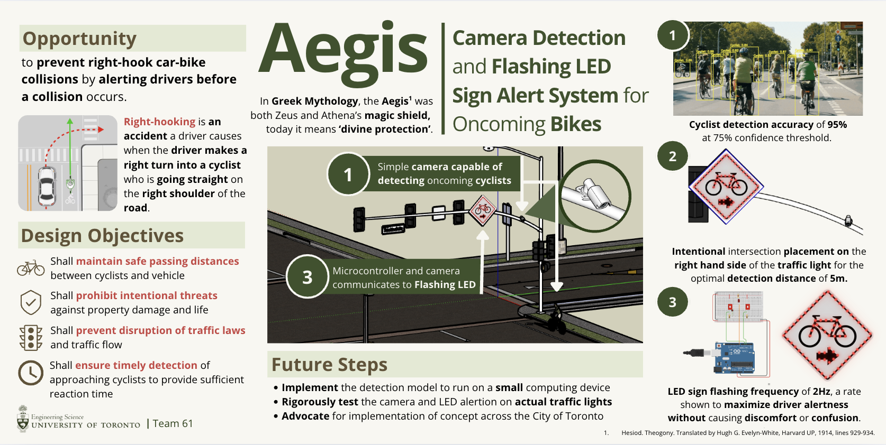
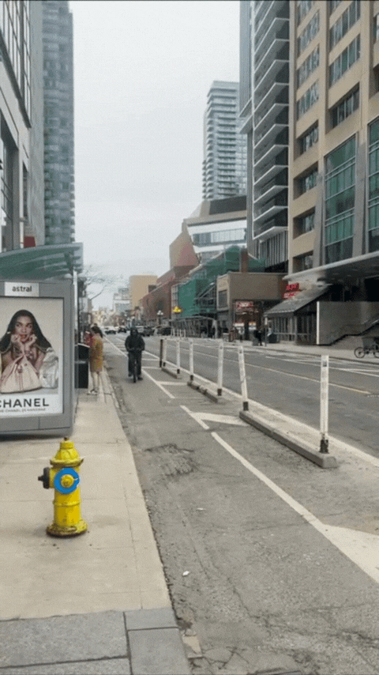
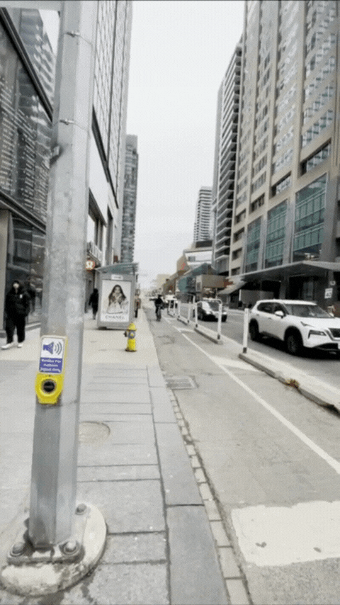
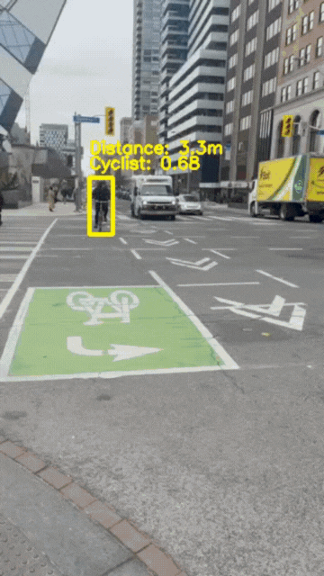
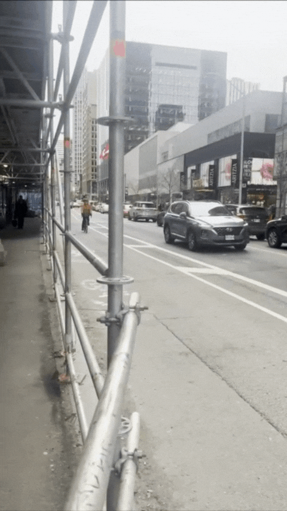

<h1 align= "center">Aegis</h1>

</img>

Aegis is an intuitive Cyclist Detection and Arduino flashing LED system aimed to protect cyclists from right-hooking incidents in the City of Toronto that computer vision (object detection with YOLOv11-nano), Arduino, engineering design, and classical mechanics. It is prototyped to have the detection and alertion system attached to the traffic light, and it flashes and warns drivers of approaching cyclists in their blindspots starting at a certain distance (determined by a modelled kinematics problem). For edge cases such as night time darkness or camera lenses affected by certain weather conditions, this project also explores SRGAN (Super Resolution Generative Adversarial Networks) models specifically for real-time upscaling of captured frames. In particular, the [Swift-SRGAN model](https://arxiv.org/pdf/2111.14320) was researched and explored to combine existing SRGAN models with depthwise separable CNNs for real-time inference.

___

### YOLO Detection Metrics:

- Speed: ~50ms average inference time (running on a MacBook M3 Pro CPU ONNX)
- 11-12 hours for transfer learning on two cyclist datasets, finetuning a pretrained COCO YOLOv11n:
    - Charles Tang (CT) [Cyclist Detection Dataset](https://universe.roboflow.com/bicycle-detection/bike-detect-ct/dataset/5)
    - Cyclist Orientation [CIMAT Dataset](https://gitlab.com/MaryChelo/cimat-cyclist)

| mAP Type  | mAP |
| -------- | ------- |
| mAP50-95  | 0.846183 |
| mAP50 | 0.985844    |
| mAP75    | 0.945719    |

Pretrained models: 
- [TensorRT](https://raw.githubusercontent.com/kseto06/Aegis/main/model/yolo/TrainedCTCIMATModels/CTCIMAT.engine)
- [ONNX](https://raw.githubusercontent.com/kseto06/Aegis/main/model/yolo/TrainedCTCIMATModels/CTCIMAT.onnx)
- [PyTorch](https://raw.githubusercontent.com/kseto06/Aegis/main/model/yolo/TrainedCTCIMATModels/CTCIMAT.pt)

---

## Project Artifacts & Documentation:

**Read the full article in this website**: [kadenseto.vercel.app](https://kadenseto.vercel.app)
 
Navigate to the Aegis article through: 
- Projects --> Aegis

 

**Request for Proposal (RFP)**: [RFP](https://docs.google.com/document/d/1bZuDZQIqMYzXFShAqbd3qogVS45IHW4aUAbIcS_Sjrw/edit?usp=sharing)
___

### Proxy Tests & Demos:

  
  
  
  
  
  

 

**Light vs. Sound Proxy Testing**: [Testing](https://drive.google.com/file/d/1fOqFEju9Q5rVdqkVZoFV2H50HvQEpceI/view?usp=sharing)

**Prototype Demo**: [Aegis Demo](https://www.youtube.com/watch?v=klIUhFy4po0)
